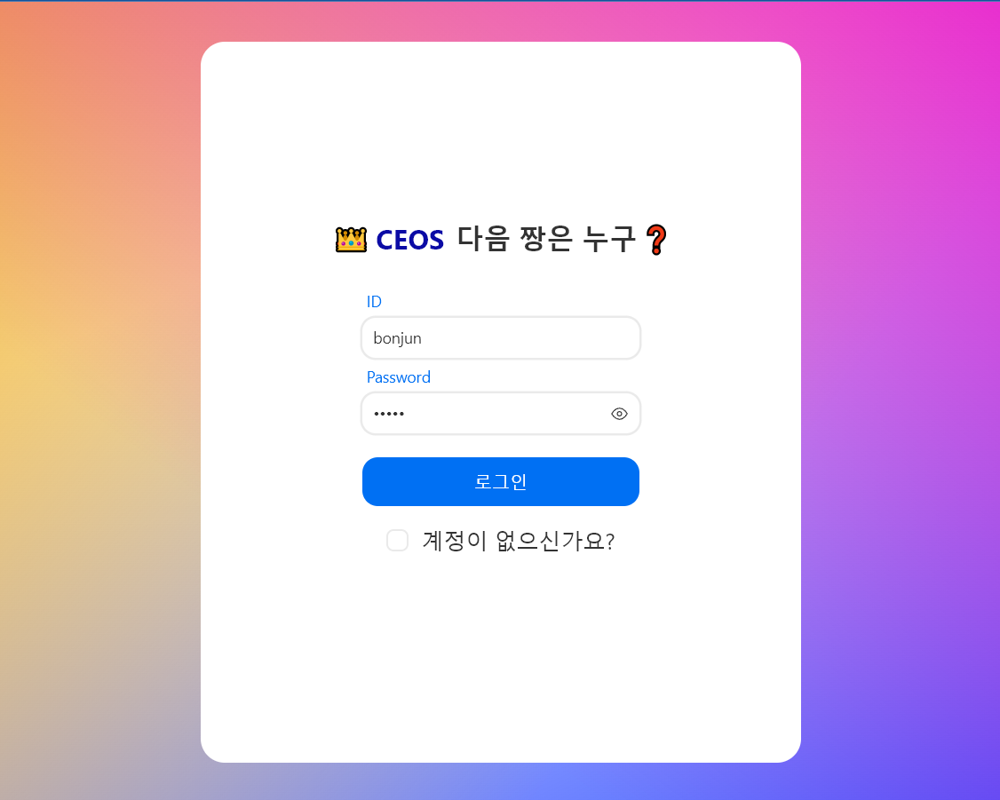
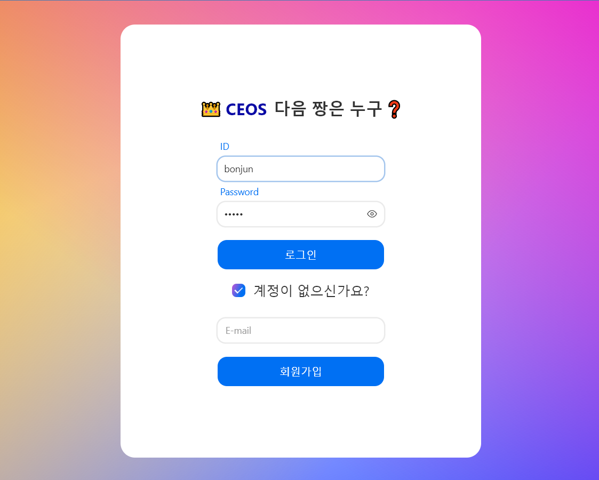
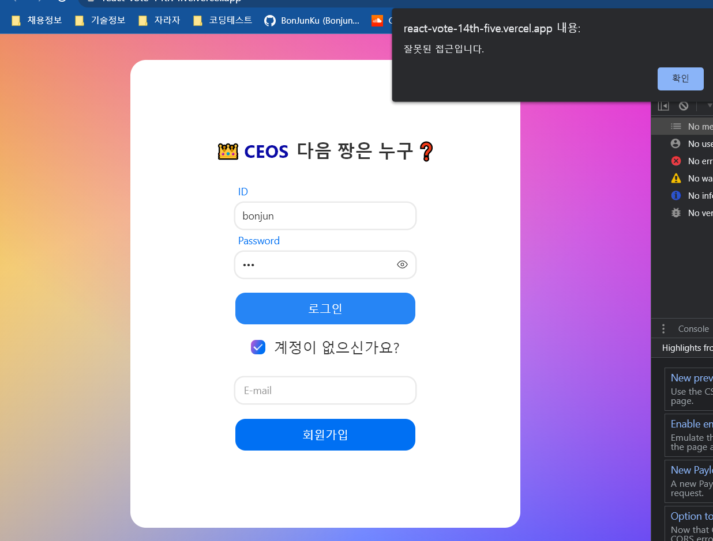
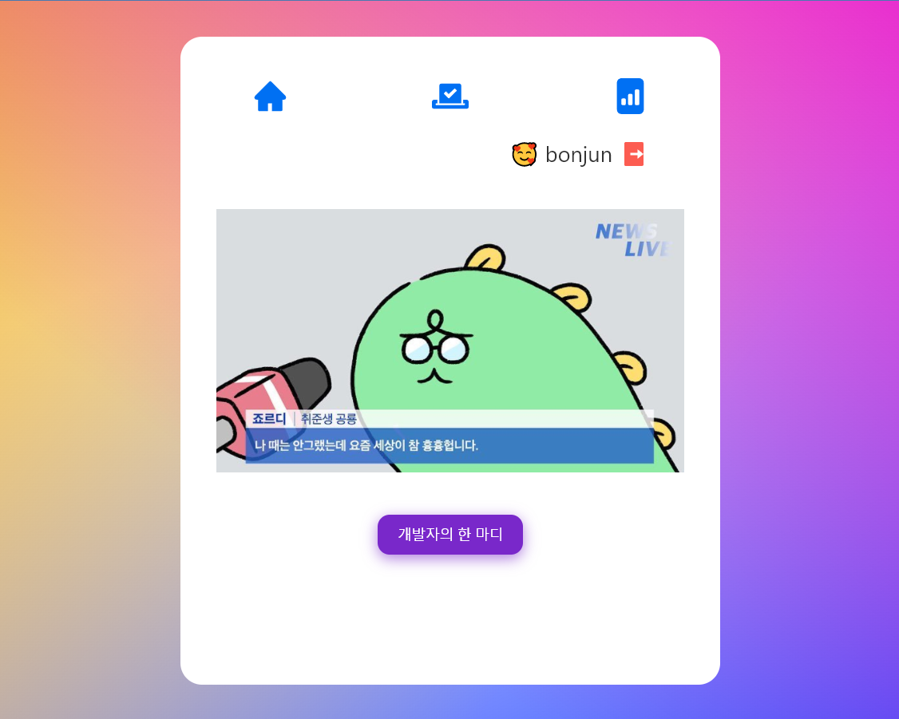
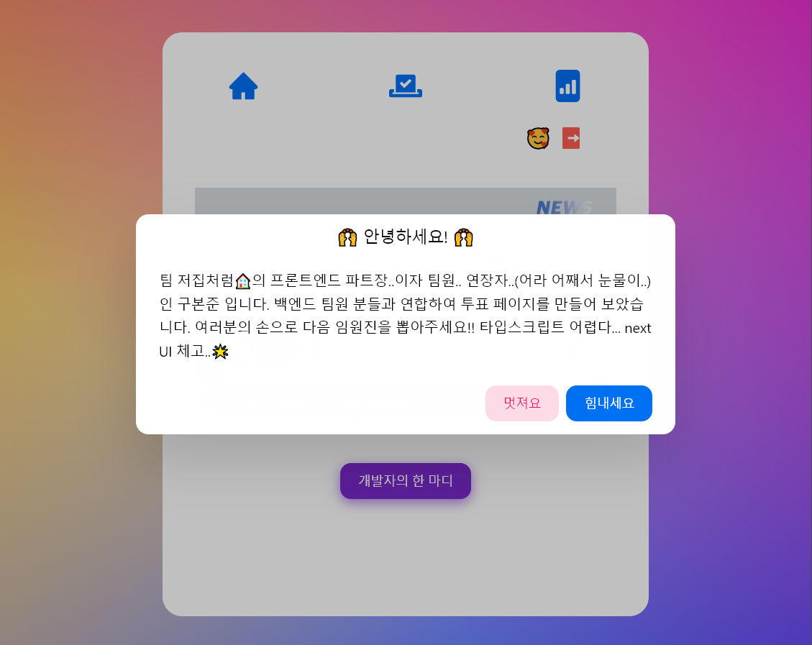
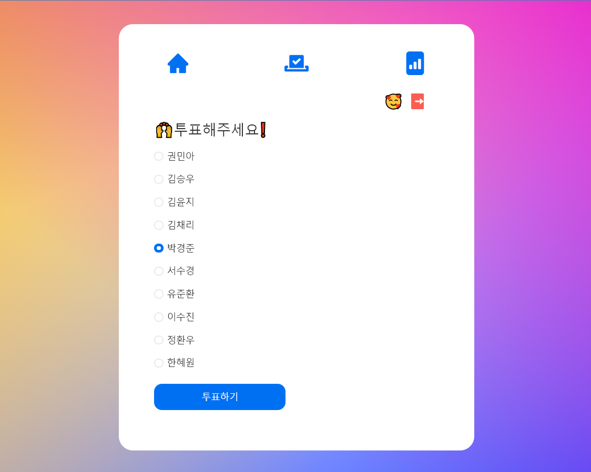
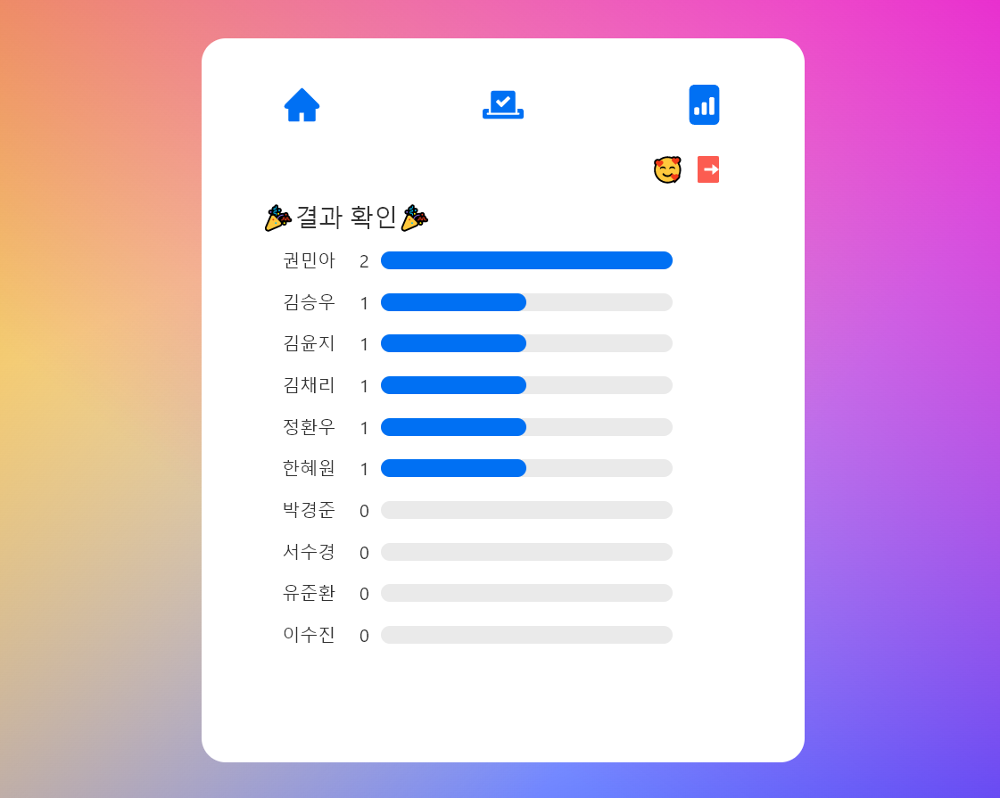

# CEOS 15기 파트장 선거 페이지 프로젝트

## ✅ 프로젝트 소개

- 신촌 IT창업동아리 내에서 진행한 자체 프로젝트로, 백엔드와 프론트엔드가 연합하여 15기 운영진을 선출하는 선거 페이지를 만드는 프로젝트입니다.

## ✅ 팀 소개 : TEAM 저집처럼🏠

|  |                                  |  |
| :----------------------------------------------------------------------------: | :------------------------------------------------------------------------------------------------------------: | :----------------------------------------------------------------------------: |
|                                     구본준                                     |                                                     김승우                                                     |                                     김윤지                                     |
|                           <a href ="">@bonjunku</a>                            | <a href ="https://github.com/Like-that-house/django-vote-14th/commits?author=seungwooKim99">@seungwookim99</a> |               <a href ="https://github.com/yoonjiy">@yoonjiy</a>               |
|                                   프론트엔드                                   |                                                     백엔드                                                     |                                     백엔드                                     |

## ✅ 결과물

- Vercel 배포 버전: <a href = "https://react-vote-14th-five.vercel.app/">바로가기</a>
- 현재 백엔드 배포 문제로 Vercel 접근이 원활하지 않습니다.
- 로컬 실행 방법:

```
npm i
npm start
```

## ✅ 결과화면

- 로그인 화면
  
- 계정이 없으면 생성가능
  
- 잘못된 접근 시 alert
  
- 메인화면
  
- 모달 구현(개발자의 TMI)



- 투표 기능



- 결과 확인
  

## ✅ 신경 쓴 부분

- 상태관리를 효율적으로 하고 싶었습니다. useReducer와 custom Hooks로 전역적인 상태관리를 시도했습니다. 기본적으로는 dispatch로 전역상태를 관리하는데, 직접 쓰기보다는 dispatch를 한 번 더 hook처럼 만들어서 사용했습니다.
- MVC패턴 적용 : 실제 View를 담당하는 렌더링 로직, 통신 및 데이터 처리를 담당하는 Service 로직, 토큰을 보관하는 db 를 따로 분리하여 MVC패턴을 적용했습니다.
- http 모듈화 : http통신 관련 자주 쓰이는 로직이 많아 클래스로 모듈화 하여 단계적으로 구성했습니다.
- Next UI 적용: NextUI로 세련된 디자인을 적용시켰습니다.abs

## ✅ 새로 배운 부분

- 비동기 로직 처리 관련 : 비동기 함수와 동기함수를 같이 써야 하는 경우가 종종 생기는데, 비동기함수는 aysnc 지옥(...) 을 만들기 때문에 로직 자체를 동기함수가 나중에 와도 되는 식으로 구성하고, 비동기 함수가 이행됐을 때 콜백을 동기함수를 넣어서 처리해주는 방법을 배웠습니다.

- 백엔드 로직: 개인적으로 백엔드 관련 지식이 전무해서 저번~이번 주동안 Express를 빠르게 공부했습니다. 미들웨어의 구성, 에러 처리, Validation, bycrypt, jwt 인증 방식 등 서버가 어떻게 데이터를 받아오고 보관하는지를 배웠습니다. 덕분에 백엔드 개발자들과 소통할 때 부족함 없이 이야기 할 수 있었습니다.

- NextUI: styled components에 비해 일장 일단이 있는 것 같습니다. NextUI의 최고 장점은 '이쁘다'는 것입니다. 하지만 세밀한 조작이 조금 불편했는데, http컴포넌트나 리액트 컴포넌트에 있는 props 가 없는 경우가 종종 있어서 불편했습니다. 그리고 가장 불편한 점은 렌더링 로직에 너무 많은 부분을 차지 한다는 점입니다. 물론 파일 쪼개기를 하면 분명 개선할 수 있는 부분도 있겠지만.. Styled Components에 비해 심플함은 떨어지는 것 같습니다.
